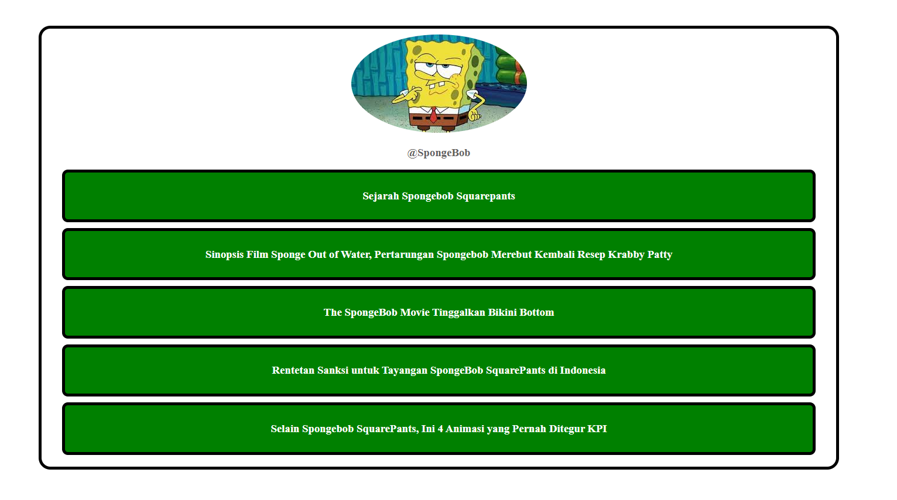

# Website Artikel SpongeBob SquarePants

Ini adalah proyek web sederhana yang menampilkan artikel-artikel menarik tentang SpongeBob SquarePants, salah satu karakter animasi paling ikonik sepanjang masa. Website ini dirancang dengan tampilan tombol-tombol yang memudahkan pengguna untuk menjelajahi berbagai topik terkait SpongeBob.

## Fitur



- **Potret SpongeBob**: Di bagian atas halaman terdapat gambar SpongeBob SquarePants, menambahkan kesan ceria dan menarik bagi pengunjung.
- **Tombol Artikel**: Website ini memiliki beberapa tombol yang mewakili artikel-artikel menarik tentang SpongeBob SquarePants dan fenomena di sekitarnya. Artikel yang tersedia di antaranya:
  1. **Sejarah SpongeBob Squarepants**: Mengupas asal-usul dan latar belakang dari karakter SpongeBob.
  2. **Sinopsis Film Sponge Out of Water**: Menceritakan perjuangan SpongeBob untuk merebut kembali resep rahasia Krabby Patty.
  3. **The SpongeBob Movie: Tinggalkan Bikini Bottom**: Mengulas film SpongeBob SquarePants dan petualangan karakter utama di luar Bikini Bottom.
  4. **Rentetan Sanksi untuk Tayangan SpongeBob SquarePants di Indonesia**: Informasi tentang sanksi atau teguran yang diterima tayangan ini di Indonesia.
  5. **Selain SpongeBob SquarePants, Ini 4 Animasi yang Pernah Ditegur KPI**: Diskusi tentang animasi lainnya yang juga mendapat teguran dari KPI.

## Teknologi yang Digunakan

- **HTML & CSS**: Struktur halaman dibuat menggunakan HTML untuk konten dan CSS untuk gaya, memastikan tampilan yang bersih dan menarik.
- **Gambar**: Memanfaatkan gambar SpongeBob sebagai daya tarik visual utama.

## Cara Menggunakan

1. Clone repository ini ke komputer Anda:
   ```bash
   git clone https://github.com/yourusername/spongebob-articles.git
